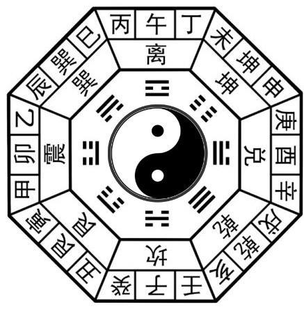
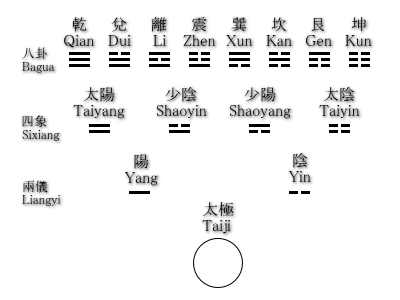
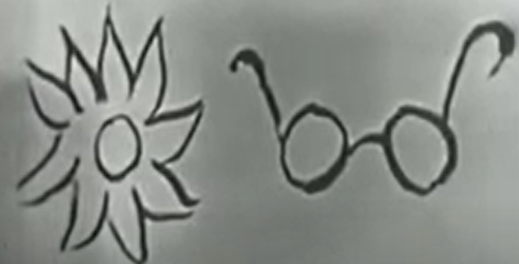

12.Law & Order
================

Introduction
--------------

*Divination* "The book of Change" (《易经》)

`wikipedia <https://en.wikipedia.org/wiki/Bagua>`_

* 阴/阳
* The eight principle elements involved in every life situtaion.

先天八卦：太极生两仪，两仪生四象，四象生八卦。

(后天八卦，乾卦在西北)

Objection
-------------------

From our modern scientific point of view, that flipping coins to come to the great descisions
of life is the stupidest thing we could possibly do. After all, it neglects all rational cogitation
about our situations.

However, when you estimate the data, when you consider the facts that are involved in any
particular decision, How do you know exactly what facts are involved? Something that out of your
thought may enter into the situation and change it utterly. And how do you know that you get enough data?
After all, the data, the causes, the problems involved in any particular situation are virtually infinite.
A matter of fact you stop getting data, stop getting problems involved, either when you are tired of it,
or when the time comes to act and you haven't time to collect any more data.
*That is just as irrational as flipping coins because you decide when to stop investigating in a very
arbitrary way.*

How about probabilistics. If you toss a coin, you may collect the tests for 1000 tosses, while this
data may various among different people (e.g. 400-600, 401-599, etc), and the actually probability
of the next toss is always half-to-half.

Alan puts that : we can never prove whether any method of coming to decisions really work.
We can never know the outcome of a decision is a failure or a success, because only the unknown
that comes next will show whether it is good or not, and the unknown stretches infinitely into the future.

View
--------

* Negative side : the acient chinese relied too meticulously upon the classification of world and events based on these symbols.
* Positive side : the book is founded in a view of life, which see not too much on the **causal relationship** between events as the **pattern of events**.
Instead of understanding events by relation to past causes, it understands events by relation to their
present pattern. In other words, it comprehends them by taking a total view instead of what we might
call a linear view (of cause-result relation, the causality).

To undertand events in its present context, (chaine of Markov?)
* The western way of looking at things : by **the order of words**, determined by what went before them. As a result, we will see the world governed by **Laws** (則), the law of nature.
* **The order of design**. The two circles in differen context have quiet different meanings. But you see their relations to their meanings all at once. The meaning of each part of the design is relative to the rest of it as you see it now at this moment.

The idea of the **I Ching** , is to reveal through its symbols that total pattern of the moment
when the question is asked on the supposition that the pattern of this moment governes even the tossing
of coins.

Law
-------------

則(Law)，義，理(organic pattern). The order of nature, the order of justice, the order of beauty
are things which we can know in ourselves, but we cannot write down in black and white. Therefore
the superior man is one who has the sensibility for these things in himself.
