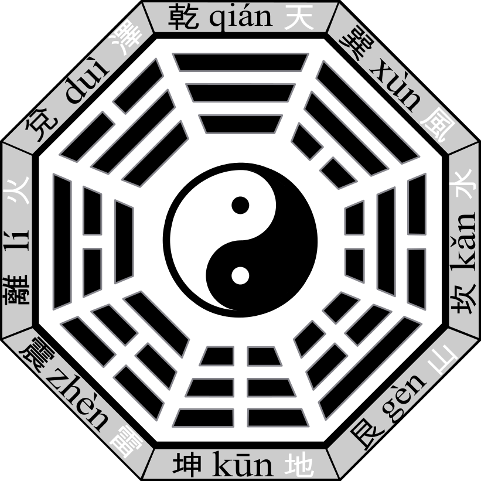

14.Law & Order
================

*Divination* "The book of Change" (《易经》)

`wikipedia <https://en.wikipedia.org/wiki/Bagua>`_

* 阴/阳
* The eight principle elements involved in every life situtaion.

先天八卦：太极生两仪，两仪生四象，四象生八卦。

.. image:: images/Xiantianbagua.png
   :width: 50%
   :align: center

(后天八卦，乾卦在西北)
