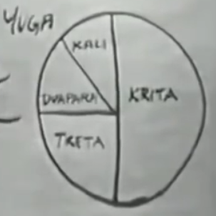
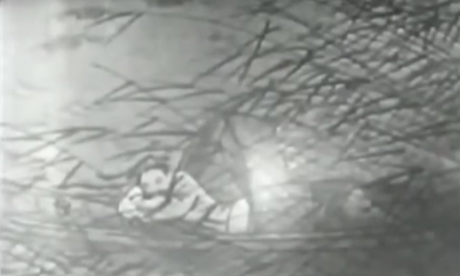

Time
==================

Illusion of Time
-----------------

An old optical illusion, the length of lines of perspective vision.
An illusion we are so used and so easily fooled.
**MAYA** : a word of indian philosophy, basicly meaning "illusion", or rather illusion brought about : "By
the exceptions of certain conventions." when we are not aware certain things we are token for grounded,
when we are not aware this is a matter of convention, we are about to be fooled.
**Time** is the convention more easier to fool us.

Humane "A time binding animal": a creature who is vivdly aware that his life as it was along a line
from the past, through the present, and into the future. While animals tend to live moment by moment.
Which gives us the ability to better plan the future (which is ofcourse, very important for us).
While we miss the truth that : **The true reality that we live, is the present moment "now".**

We spend a lot living in time, which is not here, in else-where, which is not concrete real.
So much so, that although we are quiet satisfied about our current circumstances.
If there is not a guarantee or a promise that a good time coming tomorrow, tomorrow, and tomorrow,
we are once unhappy, even we are in the mid of pleasure.
So we develop a chronic anxiety about time. we want asure more and more, beause our feelings'
sensitivity of time. As a consequence, the future becomes more important for some people than the present.

We live so much in the future. School to college to work to etc... You are always living in somewhere, where you aren't.

.. image:: images/donkey.jpg
   :width: 40%
   :align: center

Planning for future is useful, while if we always live in the future, one can never enjoy the fruit of actions.
Plan for the goodness for the future where you will never "be", is futile.
**You cannot live at all, unless you can live fully now !**

The dream of life
------------------

And because now is never satisfied as we are never living in it, we get more and more abid to
go on, and pursuit the future. We develop our technologies to fulfill our desire for the future.
If you can fulfill every wish you are wishing for :
`The dream of life <https://genius.com/Alan-watts-the-dream-of-life-annotated>`_ .
There is no real fulfillment without delay.

**Brahma** (梵天) the world creator, but he is like our dreamer to dream the existence of the world
forgetting his identity.
KALPA (劫), a period of 4,320,000 years, a day of Brahma.

* Western world, linear thought of time, or even upping line (getting better).
* While other culture, as a **CIRCLE** (watch) . And in Hinduism thought, it gets worse after each KALPA (consist of YUGA).

As YUGA goes, time becomes faster and more chaotic. As we are more and more conscious of time,
we tend more and more to pursuit the future. And as we keep pursuit the future, present life
becomes more and more unsatisfactory, and we feel we have to chase happiness at greater and
greater speed.

"The spring does not become the summer. The summer does not become the autumn. There is spring.
Then there is summer. When you burn wood there are ashes. But the wood does not become the ashes.
There is wood. And then there are ashes. " -- Dogen 《有時》, the Zen philosopher, living around 1200 AD.

春有百花秋有月，夏有凉风冬有雪。若无闲事挂心头，便是人间好时节。
("闲事": illusionary thought of pursuiting the future.)

**The present is the only place in which we live, the past and the future are no more than "useful illusion".
But uesful only when one lives in the present.**
