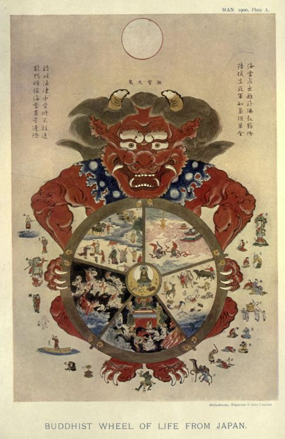

6. Death
===================

The Wheel of Life
-----------------

The Wheel of Life (轮回) : the wheel of stages of existence through which being pass, clutched
by the great demon of **impermanence** (无常).

* Human world. 人道.
* The world of Devas (angels). 天道.
* The world of Anmials. 畜生道.
* The world of Purgatory. 地狱道.
* Pretas. 饿鬼道.  (frustrated spirits, with large stomachs and ting mouths, to show enormous appetite and small means to satisfy)

**Transmigration/Reincarnation** : you can never stop anywhere. You may come to heaven, but what comes up must go down.
You may descend to hell, but what goes down eventually come up. So one goes on and on, moving through these various
worlds until you become sufficiently awakened, to become a Buddha, one who is released from the wheel, enter the
eternal state of *Nirvana*.

**The Twelve Fold Chain of Dependent Origination** (`十二緣起 <https://zh.wikipedia.org/wiki/%E7%B7%A3%E8%B5%B7>`_ ).
「依此有故彼有，此生故彼生」. A schematic diagram of the force of the process that keeps this wheel rotating.
"佛言，云何名“緣起初義”？謂：依此有故彼有，此生故彼生。所謂：無明緣行，行緣識，識緣名色，名色緣六處，六處緣觸，觸緣受，受緣愛，愛緣取，取緣有，有緣生，生緣老死，起愁、歎、苦、憂、惱，是名為純大苦蘊集，如是名為緣起初義。"

* 無明. Ignorance.
* 行. Potentialisties of life. "身行、語行、意行，是名為行".
* 識. Consciousness. "一者、眼識，二者、耳識，三者、鼻識，四者、舌識，五者、身識，六者、意識"
* 名色. A name in a boat, 'the combination of name and form'. "四無色蘊：一者、受蘊，二者、想蘊，三者、行蘊，四者、識蘊"
* 六處. Sense consciousness. "一、眼內處，二、耳內處，三、鼻內處，四、舌內處，五、身內處，六、意內處，是謂六處"
* 觸. Contact a pair of lovers. "一者、眼觸，二者、耳觸，三者、鼻觸，四者、舌觸，五者、身觸，六者、意觸，是名為觸"
* 受. Perceptions. 'A man with arrow in his eye', showing the pain involved in the perception of the world. "受有三種，謂：樂受，苦受，不苦不樂受，是名為受"
* 愛. Desire. 'A woman with twins'. "愛有三種，謂：欲愛、色愛、無色愛，是名為愛"
* 取. Grasping. "謂四取：一者、欲取，二者、見取，三者、戒禁取，四者、我語取，是名為取"
* 有. Growth. the fullness of life. "有有三種，謂：欲有、色有、無色有，是名為有"
* 生. Birth. "彼彼有情，於彼彼有情類，諸生，等生，趣，起，出現，蘊得，界得，處得，諸蘊生起，命根出現，是名為生。"
* 老死. Old age and death.
* 愁、歎、苦、憂、惱.

Buddhists do not think of these various realms of the wheel ar literal worlds, but they represents various phases of life.

Karma
---------------

The process of **KARMA**. comes from the root 'KRI-', to act to do. The action is always involves the
necessity for other actions. "This arises that becomes."

Mainly the idea of *linkage*. Life and Death invlove each other, in the same way that the two ends of
the brush, lifting up on involves lifting up the other. **Death and Life imply each other.**
Karma also involves the idea of **continuity of patterns**.

The interdependence of being and not being, of death and life. The demon of change is really a disguise
of the very source of life. Death without which life is impossible, change without which life is totally boring.
