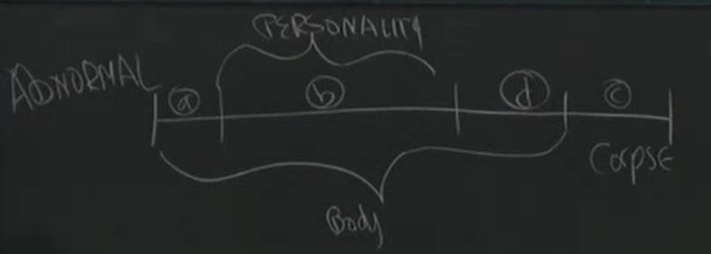

Death
=====================

what is death?
-------------------------

Human is a P-functioning body. Which functions are crucial in defining the moment of death (body functions / personality functions)?

* In C, I exist but not alive, in cropse.
* In D, I alive (bodily) but not as a person. There is no personality exists.
* In A, it is my body, but not me.

Is there something immoral about removing the organs during phas D, when the person is dead and the only thing that's still alive is the body.

**Death: the end of P-functioning** :

* Question: While you are not dead all the times when you are unconscious and not dreaming.
* Proposal: When the lack of P-functioning is temporary, you are still alive. But what will that be if God resurrects the dead on Judgment day.
* Proposal: When you are capable of engaging P-functioning, you are still alive. For the case, someone in coma.

Others
------------------

Death is unique. From the physicists' point of view, there may not be anything unusual about death.

**At some level nobody really believe they are going to die at all.**

* Noboby really believe they are going to cease to exist as a person.
* Nobody really believe they are under going the death of their bodies.

Since it is impossible to picture your own being dead (even though the assumption is questionable that : we have to picture something in order to believe it, objection: we cannot picture a dreamless sleep). When you are dead, there are nothing left to be imagined or pictured. Objection : we cannot picture our own dead from inside, while we can picture it from outside.

Objection: when we try to imagine my death (no thinking no personality, etc) from outside, I actually smuggle myself back in with my thought. So may be I am imagining my body's death, I am actually not dead as a person. -> I don't really believe I'll ever be dead.

Freud : "*After all, one's own death is beyond imagining, and whenever we try to imagine it we can see that we eally survive asspectators. Thus, the dictum could be dared in the psychoanalytic school: at bottom, no body believes in his own death. Or, and this is the same: in his unconscious, everyone of us is convinced of his immortality.*"

Objection : this argument is horrible. For an example, imagine there is a meeting without you. The fact that I am smuggling as an observor doesn't mean I don't believe that I'm obesrving in my mind's eye. It doesn't mean you are in that world.

Everyone Die Alone
---------------------

* Without the present of others.  obviously wrong.
* Even with the presence of others, we complete this process alone. while we have cases in the battlefield.
* He is doing it by himself, not corporate with others. Contra example: Group suicide.
* When I die, even corporate with others, nobody could take my position.  It seems true that we will and we can only experience our own death.  But this seems uninteresting, not revealing anything deep. It is true about everything. If anyone eat my lunch, it will end up being their lunch. Nobody can eat "my" lunch.

It is just a trivial statement talks about "My". This statement is talking about when we die,
we are like being alone, feeling distant and lonely.  But it is not for everyone. 
